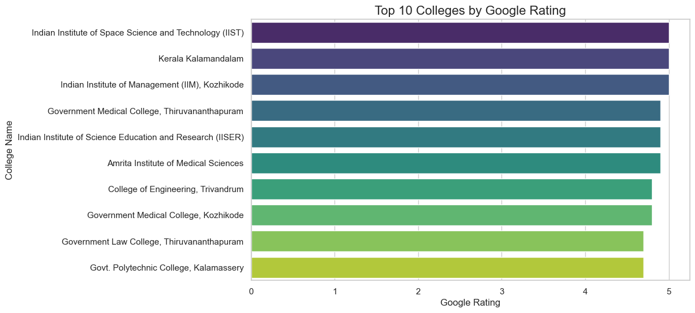
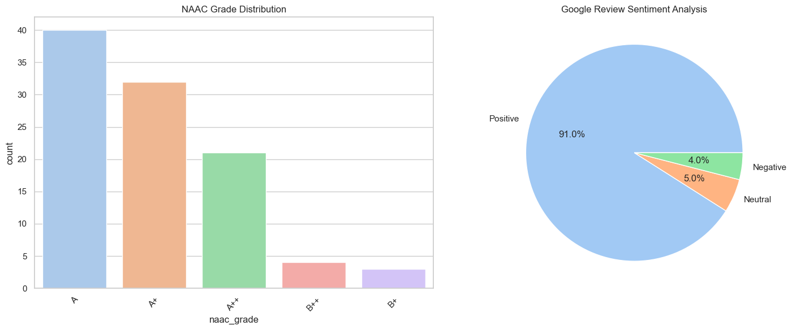

# Future Trend Course Analysis – Kerala

## 📊 Project Overview
This project analyzes trends in courses offered by colleges in Kerala using publicly collected data. The goal is to identify popular courses, assess college ratings, and present insights through an interactive Power BI dashboard and automated Python analysis.

## 🚀 Project Phases
- **Phase 1: Data Collection:** Captured 100 colleges across Kerala, verifying data via NAAC portals and government databases.
- **Phase 2: Data Cleaning:** Standardized datasets using Pandas and Excel to ensure high-quality, reliable analysis.
- **Phase 3: Exploratory Data Analysis (EDA):** Performed statistical analysis to visualize patterns in accreditation and ratings.
- **Phase 4: Sentiment Analysis:** Examined Google reviews to correlate student sentiment with institutional performance.
- **Phase 5: Power BI Dashboard:** Developed an interactive dashboard for stakeholder insights.

## 🛠 Tech Stack
- **Data Engineering:** Python (Pandas)
- **Visualization:** Matplotlib, Seaborn, Microsoft Power BI
- **Tools:** VS Code, Jupyter Notebooks

## 📈 Visual Insights
We have automated the analysis to provide key metrics instantly.

| Top Colleges by Rating | Sentiment Distribution |
| :--- | :--- |
|  |  |

## 📁 Repository Structure
```text
College_Analysis_Project/
├── data/                # Raw dataset
├── images/              # Auto-generated analytical plots
├── analysis.ipynb       # Python analysis pipeline
└── Power_BI_Dashboard.pdf # Interactive Dashboard Export